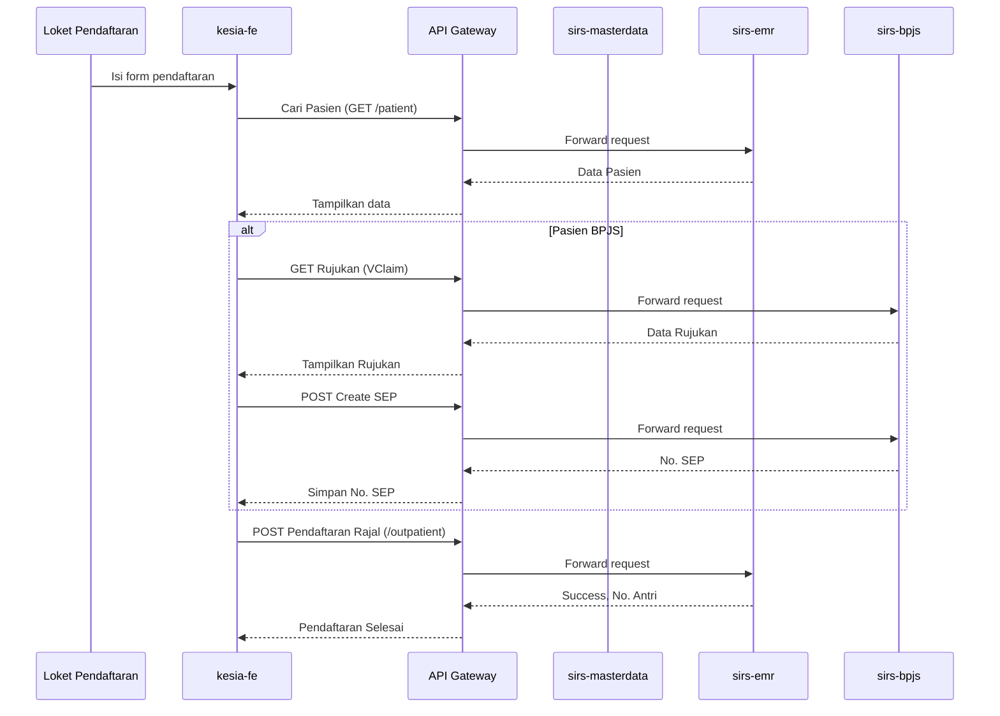

# Laporan Komprehensif: Alur Kerja End-to-End SIRS Kesia
*Dokumen ini menggabungkan analisis dari berbagai unit pelayanan (Rawat Jalan, Rawat Inap, IGD) menjadi satu panduan terpadu, menyoroti alur kerja, aktor, dan titik divergensi berdasarkan jenis penjamin (Umum, Perusahaan, BPJS).*

---

## Ringkasan Eksekutif & Komponen Inti

Aplikasi SIRS Kesia dimodelkan berdasarkan arsitektur microservices yang menangani berbagai domain fungsional. Alur kerja pasien, dari pendaftaran hingga penyelesaian, melintasi beberapa aplikasi frontend dan layanan backend.

### Aktor Utama (Lintas Unit)
- **Admisi/Pendaftaran:** `er-registration`, `outpatient-registration`, `inpatient/new`
- **Tim Medis (Perawat & Dokter):** `er-nurse`, `er-doctor`, `outpatient-nurse`, `outpatient-doctor`, `inpatient-nurse`, `inpatient/doctor`
- **Penunjang Medis & Farmasi:** `medical-support`, `er-pharmacy`, `outpatient-pharmacy`, `inpatient-pharmacy`
- **Administrasi Keuangan:** `cashier`, `billing-staff`, `casemix`

### Microservices Kunci
- **`sirs-emr-microservice`**: Jantung dari proses klinis. Menangani data EMR, episode pasien (Rajal, Ranap, IGD), billing, resep, dan alur kerja medis.
- **`sirs-masterdata-microservice`**: Mengelola semua data master seperti pasien, dokter, jadwal, item, tindakan, dan tarif.
- **`sirs-bpjs-microservice`**: Jembatan ke layanan VClaim dan Antrean Online BPJS. Mengelola SEP, rujukan, dan surat kontrol.
- **`kesia-fe`**: Aplikasi frontend utama yang digunakan oleh sebagian besar aktor internal rumah sakit.

---

# Alur Kerja E2E SIRS Kesia - RAWAT JALAN

Dokumen ini merinci alur kerja end-to-end untuk modul Rawat Jalan di SIRS Kesia, mencakup pendaftaran, pelayanan, hingga penyelesaian administrasi untuk tiga jenis penjamin: Umum, Perusahaan, dan BPJS.

## A. Titik Masuk & Aktor Utama

-   **Pendaftaran (Admission):** `outpatient-registration` (Loket), `er-registration` (jika dari IGD), Kiosk, Mobile App.
-   **Perawat (Nurse):** `outpatient-nurse` (Asesmen awal, vital sign).
-   **Dokter (Doctor):** `outpatient-doctor` (SOAP, diagnosa, resep, tindakan).
-   **Farmasi (Pharmacy):** `outpatient-pharmacy` (Penyiapan & penyerahan obat).
-   **Kasir (Cashier):** `cashier` (Pembayaran).
-   **Staf Billing (Billing Staff):** `billing-staff` (Verifikasi & klaim).

## B. Alur Pendaftaran (Admisi)

Alur ini dimulai di page `kesia-fe/src/pages/outpatient-registration`.

### B.1. Pendaftaran Pasien Baru vs. Lama

1.  **Pencarian Pasien:** Petugas menggunakan `PatientAutocomplete` untuk mencari pasien berdasarkan No. RM, Nama, atau NIK.
    -   **Backend:** `sirs-emr-microservice` -> `PatientController.js` -> `GET /api/v1/emr/patient`
2.  **Pasien Baru:** Jika tidak ditemukan, petugas akan mendaftar sebagai pasien baru (`FormPrimaryPersonalData.js`).
    -   **Validasi NIK:** Dilakukan via `bridging-disdukcapil` jika terkonfigurasi.
    -   **Backend:** `sirs-emr-microservice` -> `PatientRegistrationController.js` -> `POST /api/v1/emr/patient-registration`
3.  **Pasien Lama:** Data pasien yang ada akan ditampilkan dan petugas melanjutkan ke pemilihan poliklinik dan dokter.

### B.2. Pemilihan Poliklinik & Penjamin

1.  **Pemilihan Jadwal:** Petugas memilih poliklinik (unit), dokter, dan jadwal yang tersedia.
    -   **Backend:** `sirs-masterdata-microservice` -> `DoctorScheduleController.js` -> `GET /api/v1/masterdata/doctor-schedule`
2.  **Pemilihan Penjamin (`insurerType`):** Ini adalah titik divergensi utama alur.
    -   **Umum (General):** Pasien membayar sendiri.
    -   **Perusahaan/Asuransi (Company/Insurance):** Memerlukan pemilihan perusahaan dari `company-partner`.
    -   **BPJS:** Memerlukan nomor rujukan (dari FKTP atau internal) atau nomor surat kontrol.

#### Alur Spesifik BPJS pada Pendaftaran:

-   **Validasi Rujukan/SEP:** Sistem akan melakukan bridging ke VClaim BPJS.
    -   **FE:** `kesia-fe/src/pages/bridging-bpjs`
    -   **BE:** `sirs-bpjs-microservice`
-   **Pembuatan SEP (Surat Eligibilitas Peserta):** Jika rujukan valid, SEP akan dibuat secara otomatis. Nomor SEP akan disimpan dan menjadi kunci untuk proses klaim selanjutnya.
    -   **BE:** `POST /api/v1/bpjs/sep`

### B.3. Konfirmasi & Cetak Struk

-   Setelah semua data terisi, pendaftaran dikonfirmasi.
-   **Backend:** `sirs-emr-microservice` -> `OutpatientController.js` -> `POST /api/v1/emr/outpatient`
-   Sistem menghasilkan nomor antrian poliklinik dan mencetak struk pendaftaran. Episode pasien (`emr_episode`) dibuat dengan status 'check-in'.

## C. Alur Pelayanan di Poliklinik

### C.1. Asesmen Awal oleh Perawat

-   **Aktor:** Perawat di `outpatient-nurse`.
-   Perawat memanggil pasien dari antrian (`PolyQueueTv`).
-   Melakukan asesmen awal, mengukur tanda-tanda vital (TTV).
-   **FE:** `kesia-fe/src/pages/outpatient-nurse/assessment`
-   **BE:** Data disimpan dalam `emr_episode` atau tabel terkait seperti `vital_sign`. `POST /api/v1/emr/vital-sign`.

### C.2. Pemeriksaan oleh Dokter

-   **Aktor:** Dokter di `outpatient-doctor`.
-   Dokter memanggil pasien dan melihat data asesmen awal dari perawat.
-   **Pemeriksaan & SOAP:** Dokter melakukan anamnesa, pemeriksaan fisik, dan mencatatnya dalam format SOAP (Subjective, Objective, Assessment, Planning).
    -   **FE:** `kesia-fe/src/pages/outpatient-doctor/integrated-note`
    -   **BE:** `sirs-emr-microservice` -> `IntegratedNoteController.js` -> `POST/PUT /api/v1/emr/integrated-note`
-   **Input Diagnosa (ICD-10):** Dokter memasukkan diagnosa primer dan sekunder.
    -   **BE:** `sirs-masterdata-microservice` untuk mencari ICD, disimpan bersama `integrated_note`.
-   **Input Tindakan (ICD-9/Lainnya):** Dokter dapat menambahkan tindakan medis yang dilakukan.
    -   **BE:** `sirs-emr-microservice` -> `MedicalServiceCostController.js`. Tindakan ini akan masuk ke rincian tagihan.
-   **Membuat Resep (Prescription):**
    -   **Tipe Resep:** Resep bisa berupa obat jadi atau racikan.
    -   **FE:** `kesia-fe/src/pages/outpatient-doctor/prescription`
    -   **BE:** `sirs-emr-microservice` -> `PrescriptionController.js` -> `POST /api/v1/emr/prescription`.
-   **Membuat Rujukan Penunjang Medis (Lab/Rad):**
    -   **FE:** `kesia-fe/src/pages/outpatient-doctor/medical-support`
    -   **BE:** `sirs-emr-microservice` -> `MedicalSupportController.js` -> `POST /api/v1/emr/medical-support`. Order akan muncul di unit lab/radiologi.
-   **Surat Kontrol (untuk Pasien BPJS):** Jika perlu kontrol ulang, dokter membuat surat kontrol.
    -   **FE:** `kesia-fe/src/pages/adminBpjs/control-plan-letter`
    -   **BE:** `sirs-bpjs-microservice` -> `POST /vclaim/suratkontrol`.

## D. Alur Farmasi

-   **Aktor:** Apoteker/Asisten Apoteker di `outpatient-pharmacy`.
-   Resep dari dokter secara otomatis masuk ke antrian farmasi.
-   Apoteker melakukan verifikasi resep, menyiapkan obat, dan menyerahkannya kepada pasien.
-   **Stock:** Sistem akan memotong stok obat dari gudang farmasi.
    -   **BE:** Interaksi dengan `sirs-erp-poster-microservice` atau modul inventory internal.
-   **Tagihan Obat:** Biaya obat secara otomatis masuk ke dalam tagihan pasien.

## E. Alur Penyelesaian Administrasi & Pembayaran

### E.1. Generasi Tagihan (Billing)

-   Tagihan (`invoice`) digenerate secara otomatis, mengakumulasi semua biaya:
    -   Registrasi & Konsultasi Dokter
    -   Tindakan Medis
    -   Obat-obatan dari Farmasi
    -   Pemeriksaan Penunjang (Lab/Rad)
-   **BE:** `sirs-emr-microservice` -> `InvoiceController.js`.

### E.2. Proses Pembayaran (Divergensi per Penjamin)

-   **Aktor:** Kasir di `cashier`.

#### Penjamin Umum:
1.  Kasir memanggil pasien.
2.  Pasien melakukan pembayaran secara tunai, debit, atau kredit.
3.  Kasir menutup tagihan. `emr_episode` status menjadi 'closed'.

#### Penjamin Perusahaan:
1.  Kasir memverifikasi detail penjamin dan benefit yang ditanggung.
2.  Jika ada selisih biaya (co-payment) yang tidak ditanggung, pasien membayarnya.
3.  Tagihan ditandai sebagai "Piutang Perusahaan".
4.  Staf `billing-staff` nantinya akan melakukan penagihan kolektif ke perusahaan terkait.

#### Penjamin BPJS:
1.  **Grouping & Klaim:** Staf `billing-staff` atau `casemix` akan memproses tagihan.
    -   **FE:** `kesia-fe/src/pages/casemix`
2.  Semua tindakan dan diagnosa di-grouping menggunakan INA-CBG's Grouper (terintegrasi via `sirs-bpjs-microservice`).
3.  Hasil grouping menghasilkan biaya klaim yang akan diajukan ke BPJS.
4.  Klaim dikirim secara elektronik. Pasien tidak melakukan pembayaran apa pun (kecuali ada tindakan/obat di luar tanggungan BPJS, yang seharusnya sudah diinformasikan di awal).
5.  Tagihan ditandai sebagai "Piutang BPJS".

## F. Diagram Alur Data (Sequence Diagram - High Level)

---
Analisis awal ini mencakup alur utama Rawat Jalan. Saya akan melanjutkan dengan analisis Rawat Inap.
\n\n---\n\n# Alur Kerja E2E SIRS Kesia - RAWAT INAP

Dokumen ini adalah kelanjutan dari analisis sebelumnya, berfokus pada alur kerja end-to-end untuk modul Rawat Inap (Ranap) di SIRS Kesia.

## A. Titik Masuk & Aktor Utama

-   **Pendaftaran (Admission):** `inpatient/new` (Admisi Ranap).
-   **Perawat Ruangan (Ward Nurse):** `inpatient-nurse`.
-   **Dokter Penanggung Jawab Pelayanan (DPJP):** `inpatient/doctor`.
-   **Farmasi (Pharmacy):** `inpatient-pharmacy`.
-   **Kasir & Staf Billing:** `cashier`, `billing-staff`.
-   **Manajemen Bed:** `bed-management`.

## B. Alur Pendaftaran (Admisi Rawat Inap)

Pendaftaran rawat inap memiliki tiga sumber utama: dari Rawat Jalan (Rajal), dari IGD, atau pendaftaran langsung (planned admission).

### B.1. Sumber Pendaftaran

1.  **Dari Rajal/IGD (via SPRI/Pengantar Rawat Inap):**
    -   Dokter di Rajal (`outpatient-doctor`) atau IGD (`er-doctor`) merekomendasikan rawat inap.
    -   Dokter membuat "Pengantar Rawat Inap" atau SPRI (Surat Perintah Rawat Inap) untuk pasien BPJS.
    -   **FE:** `.../outpatient-doctor/opname-introduction`
    -   **BE:** `sirs-emr-microservice` -> `OpnameIntroductionController.js` -> `POST /api/v1/emr/opname-introduction`
    -   Data pengantar ini akan muncul di loket pendaftaran rawat inap sebagai "pasien rujukan internal".

2.  **Pendaftaran Langsung (Direct/Planned Admission):**
    -   Pasien datang langsung ke loket pendaftaran rawat inap dengan surat pengantar dari dokter luar atau untuk prosedur elektif.
    -   Petugas langsung membuka form pendaftaran di `inpatient/new`.

### B.2. Proses di Loket Admisi Rawat Inap

-   **Aktor:** Petugas Admisi di `kesia-fe/src/pages/inpatient`.
-   **Tampilan:** `InpatientListView.js` menampilkan daftar pasien yang sedang dirawat dan juga daftar antrian dari SPRI/Pengantar.

1.  **Pemilihan Pasien:** Petugas memilih pasien dari daftar antrian atau mencari pasien secara manual.
2.  **Form Pendaftaran (`InPatientDataForm.js`):**
    -   **Verifikasi Data Pasien:** Data demografi dari pendaftaran awal (Rajal/IGD) akan terisi otomatis.
    -   **Pemilihan Penjamin:** Sama seperti Rajal, ini adalah titik krusial.
        -   **Umum:** Pasien membayar deposit.
        -   **Perusahaan:** Verifikasi surat jaminan dari perusahaan.
        -   **BPJS:** Memerlukan SEP Rawat Inap. Petugas akan membuat SEP baru berdasarkan SPRI yang sudah ada.
            -   **BE Bridging:** `sirs-bpjs-microservice` -> `POST /vclaim/sep/insert`.
    -   **Pemilihan Kamar (Bed):**
        -   Petugas mencari dan memilih kamar yang tersedia berdasarkan kelas perawatan yang hak pasien.
        -   **FE:** `kesia-fe/src/pages/bed-management`
        -   **BE:** `sirs-emr-microservice` -> `BedTransactionController.js` -> `POST /api/v1/emr/bed-transaction`. Bed yang dipilih akan di-lock statusnya menjadi "On Administration".
    -   **Input DPJP:** Memilih Dokter Penanggung Jawab Pelayanan.
3.  **Konfirmasi & Check-in:**
    -   Setelah semua data lengkap dan deposit/SEP terverifikasi, pasien di-check-in-kan.
    -   **BE:** `sirs-emr-microservice` -> `InpatientController.js` -> `POST /api/v1/emr/inpatient`.
    -   Status bed berubah dari "On Administration" menjadi "In Bed". Pasien secara resmi masuk ke dalam daftar pasien rawat inap.

## C. Alur Pelayanan di Ruang Perawatan

### C.1. Asesmen dan Perawatan oleh Perawat

-   **Aktor:** Perawat Ruangan di `inpatient-nurse`.
-   Pasien muncul di daftar pasien di unit/ruangan perawat.
-   **CPPT (Catatan Perkembangan Pasien Terintegrasi):** Perawat melakukan asesmen, memberikan obat, melakukan tindakan keperawatan, dan mencatat semuanya di CPPT. Ini adalah log utama selama perawatan.
    -   **FE:** `.../inpatient-nurse/integrated-note`
    -   **BE:** `sirs-emr-microservice` -> `IntegratedNoteController.js`
-   **Observasi TTV:** Pengukuran dan pencatatan tanda-tanda vital secara berkala.
-   **Manajemen Diet:** Berkoordinasi dengan unit gizi.

### C.2. Visite dan Instruksi oleh Dokter (DPJP)

-   **Aktor:** DPJP di `inpatient/doctor`.
-   DPJP melakukan visite harian, mereview perkembangan pasien melalui CPPT.
-   Memberikan instruksi medis baru, mengubah terapi, membuat resep tambahan, atau merencanakan tindakan lebih lanjut. Semua dicatat di CPPT.
-   **Order Penunjang/Konsul:** DPJP dapat membuat order Lab, Radiologi, atau konsul ke spesialis lain langsung dari sistem.

### C.3. Alur Farmasi Rawat Inap

-   **Aktor:** Farmasi di `inpatient-pharmacy`.
-   Resep dari DPJP masuk ke antrian farmasi.
-   Sistem UDD (Unit Dose Dispensing) sering digunakan, di mana farmasi menyiapkan obat per dosis untuk waktu tertentu (misal, 24 jam).
-   Biaya obat dan alkes (alat kesehatan) otomatis ditambahkan ke tagihan pasien.

## D. Alur Transfer dan Discharge

### D.1. Transfer Antar Ruangan

-   Jika kondisi pasien berubah, DPJP bisa menginstruksikan transfer (misal, dari ruang biasa ke ICU).
-   **FE:** `.../inpatient-nurse/transfer-between-room`
-   **BE:** `sirs-emr-microservice` -> `TransferBetweenRoomController.js`. Proses ini melibatkan update `bed_transaction` dan `inpatient` record.

### D.2. Perencanaan Pulang (Discharge Planning)

-   Ketika kondisi pasien membaik dan dinyatakan boleh pulang oleh DPJP.
-   DPJP menulis instruksi pulang di CPPT.
-   Perawat memulai proses perencanaan pulang.
    -   **FE:** `.../inpatient-nurse/discharge-planning`
    -   **BE:** `sirs-emr-microservice` -> `DischargePlanningController.js`.
-   Proses ini mencakup edukasi pasien, penyiapan obat pulang, dan pembuatan surat kontrol jika diperlukan.

### D.3. Proses Pre-Checkout & Finalisasi Billing

1.  **Pre-Checkout:** Perawat mengubah status pasien menjadi "Pre-Checkout".
    -   Ini adalah sinyal bagi `billing-staff` dan `cashier` bahwa pasien akan pulang dan tagihan harus segera diselesaikan.
2.  **Finalisasi Tagihan:** Staf billing mereview semua item tagihan, memastikan tidak ada yang terlewat.
    -   **FE:** `.../billing-staff/inpatient-billing`
3.  **Proses Klaim BPJS/Asuransi:**
    -   Untuk pasien BPJS, staf `casemix` akan melakukan grouping INA-CBG's. Prosesnya mirip dengan Rawat Jalan, namun dengan tarif dan kode yang spesifik untuk rawat inap.
    -   Untuk pasien Asuransi, laporan medis dan rincian tagihan disiapkan untuk proses klaim.
4.  **Pembayaran di Kasir:**
    -   Pasien/keluarga menuju kasir (`cashier`).
    -   **Umum:** Membayar sisa tagihan setelah dikurangi deposit.
    -   **Perusahaan/BPJS:** Membayar selisih/biaya pribadi jika ada. Jika tidak ada, kasir hanya menutup tagihan tanpa transaksi uang.
5.  **Discharge:** Setelah administrasi selesai, kasir mengubah status pasien menjadi "Checked-out".
    -   Perawat mendapat notifikasi dan memperbolehkan pasien pulang.
    -   Status bed di `bed-management` menjadi "dirty", menandakan perlu dibersihkan sebelum bisa diisi lagi.

---
Analisis alur Rawat Inap selesai. Selanjutnya, saya akan menganalisis alur IGD.
\n\n---\n\n# Alur Kerja E2E SIRS Kesia - INSTALASI GAWAT DARURAT (IGD)

Dokumen ini melengkapi seri analisis dengan merinci alur kerja end-to-end untuk modul IGD (Emergency Room), yang dirancang untuk menangani pasien dengan kondisi gawat darurat.

## A. Prinsip Utama & Aktor

-   **Prinsip Utama:** *Life-saving first, administration later*. Proses administrasi seringkali berjalan paralel atau bahkan setelah tindakan penyelamatan awal dilakukan.
-   **Aktor Utama:**
    -   **Petugas Pendaftaran IGD:** `er-registration`.
    -   **Perawat Triase & IGD:** `er-nurse`.
    -   **Dokter Jaga IGD:** `er-doctor`.
    -   **Apoteker IGD:** `er-pharmacy`.
    -   **Staf Billing & Kasir:** `billing-staff`, `cashier`.

## B. Alur Pendaftaran & Triase

Ini adalah tahap paling kritis dan berbeda dari unit lain.

### B.1. Kedatangan Pasien

1.  **Pasien Datang:** Pasien tiba di IGD, bisa diantar keluarga atau ambulans.
2.  **Triase oleh Perawat:** Pasien segera dibawa ke area triase. Perawat melakukan penilaian cepat untuk menentukan tingkat kegawatan.
    -   **FE:** `kesia-fe/src/pages/er-nurse/Triage`
    -   **Logika:** Sistem menggunakan skor (misalnya ATS - Australasian Triage Scale) berdasarkan vital sign, keluhan utama, dan mekanisme cedera untuk mengklasifikasikan pasien ke dalam beberapa level prioritas (misal: Merah, Kuning, Hijau, Hitam).
    -   **BE:** `sirs-emr-microservice` -> `TriageController.js` -> `POST /api/v1/emr/triage`.
    -   **Output:** Pasien langsung diarahkan ke zona perawatan yang sesuai (Resusitasi, Kritis, Non-Kritis) berdasarkan hasil triase.

### B.2. Pendaftaran Pasien (Paralel)

-   **Aktor:** Petugas Pendaftaran IGD di `er-registration`.
-   Pendaftaran seringkali dilakukan oleh keluarga pasien saat pasien sudah ditangani secara medis.
1.  **Pencarian Pasien:** Petugas mencari data pasien di sistem.
2.  **Pasien Tidak Dikenal/Mr. X:** Jika identitas pasien tidak diketahui (misal: pasien tidak sadar dan tanpa keluarga), sistem memungkinkan pendaftaran sebagai "Mr. X" atau "Mrs. Y" dengan data minimal. Data ini bisa dilengkapi atau digabungkan (`merge patient`) nanti.
3.  **Pendaftaran Normal:** Jika data bisa didapat, prosesnya mirip dengan pendaftaran Rajal: mengumpulkan data demografi dan penjamin.
    -   **FE:** `kesia-fe/src/pages/er-registration/add`
    -   **BE:** `sirs-emr-microservice` -> `ErController.js` -> `POST /api/v1/emr/er`.
4.  **Penjamin:**
    -   **BPJS:** Dalam kondisi darurat, pasien BPJS bisa langsung ke IGD rumah sakit tanpa rujukan FKTP. Petugas akan membuat SEP IGD.
    -   **Umum/Perusahaan:** Penjamin dicatat, namun fokus utama tetap pada penanganan medis. Verifikasi jaminan bisa menyusul.

## C. Alur Pelayanan Medis di IGD

### C.1. Asesmen Awal oleh Dokter & Perawat

-   **Aktor:** `er-doctor`, `er-nurse`.
-   Di zona perawatan, tim medis melakukan asesmen yang lebih mendalam (Primary & Secondary Survey).
-   **FE:** `.../er-doctor/InitialAssessmentDoctor`, `.../er-nurse/AssessmentEr`
-   Semua temuan, instruksi, dan tindakan dicatat secara real-time di CPPT versi IGD.
-   **BE:** `sirs-emr-microservice` -> `IntegratedNoteController.js`

### C.2. Tindakan dan Terapi Darurat

-   Dokter memberikan instruksi untuk tindakan penyelamatan, pemberian obat darurat, pemasangan infus, dll.
-   **FE:** `.../er-doctor/OrderAction`
-   Perawat mengeksekusi instruksi dan mencatatnya.
-   Biaya tindakan dan obat/alkes secara otomatis ditambahkan ke tagihan sementara (`temporary billing`) pasien.
-   **Permintaan Penunjang:** Order CITO (segera) untuk Lab atau Radiologi dapat dibuat.
    -   `.../er-doctor/medical-support`. Hasil akan muncul di EMR IGD setelah selesai.

## D. Alur Farmasi IGD

-   Farmasi IGD atau depo farmasi darurat melayani permintaan obat CITO.
-   Obat dan alkes yang digunakan langsung dipotong dari stok darurat dan dibebankan ke pasien.
-   **FE:** `er-pharmacy`.

## E. Alur Disposisi Pasien (Penentuan Nasib Pasien)

Setelah stabilisasi dan observasi, Dokter Jaga IGD akan menentukan langkah selanjutnya:

1.  **Boleh Pulang (Discharged):**
    -   Kondisi pasien tidak memerlukan rawat inap.
    -   Dokter memberikan resep obat pulang dan surat keterangan sakit jika perlu.
    -   Pasien/keluarga menyelesaikan administrasi di kasir.
    -   **FE:** `.../er-doctor/DischargeResume`.

2.  **Rawat Inap (Admitted):**
    -   Kondisi pasien memerlukan perawatan lebih lanjut.
    -   Dokter membuat "Pengantar Rawat Inap" dari IGD.
    -   **Proses ini sama seperti alur pendaftaran rawat inap dari Rajal:** `OpnameIntroductionController.js` diaktifkan, dan pasien masuk ke antrian pendaftaran ranap. Keluarga pasien akan mengurus administrasi di loket rawat inap.
    -   **Billing:** Tagihan IGD akan digabungkan (`merge billing`) dengan tagihan rawat inap nantinya. Ini penting untuk pasien BPJS agar menjadi satu episode perawatan.

3.  **Dirujuk (Referred):**
    -   Pasien memerlukan penanganan yang tidak dapat disediakan oleh rumah sakit (misal: perlu spesialis/alat yang tidak ada).
    -   Dokter membuat surat rujukan ke rumah sakit lain.
    -   Pasien/keluarga menyelesaikan administrasi untuk perawatan yang telah diberikan di IGD sebelum ditransfer.

## F. Alur Administrasi & Pembayaran IGD

-   Prinsipnya sama dengan unit lain, namun seringkali diselesaikan setelah disposisi pasien jelas.
-   **Tagihan:** Di-generate oleh `sirs-emr-microservice` -> `InvoiceController.js`, seringkali dengan flag `is_er_invoice=true`.
-   **Pembayaran:**
    -   **Jika pasien pulang:** Keluarga menyelesaikan tagihan di kasir.
    -   **Jika pasien rawat inap:** Tagihan IGD "ditahan" dan akan digabungkan dengan tagihan rawat inap oleh `billing-staff`.
        -   **BE:** Ada logika di `InvoiceController.js` atau proses billing yang mencari `opname_introduction` untuk menarik `er_episode_id` dan menggabungkan biayanya.
    -   **Klaim BPJS:** Episode IGD dan Rawat Inap harus dijadikan satu kesatuan klaim agar terbayar oleh BPJS. Jika dipisah, kemungkinan besar klaim IGD akan ditolak.

---
Analisis alur IGD telah selesai. Dengan ini, ketiga alur utama (Rajal, Ranap, IGD) telah dipetakan. Langkah terakhir adalah menyusun laporan gabungan.
\n\n---\n\n
## Analisis Komparatif Alur Penjamin

Meskipun alur medis (pemeriksaan, pengobatan) cenderung sama, alur administrasi sangat bervariasi berdasarkan penjamin.

| Tahapan | Penjamin Umum | Penjamin Perusahaan/Asuransi | Penjamin BPJS |
| :--- | :--- | :--- | :--- |
| **Pendaftaran** | Bayar langsung/Deposit. | Verifikasi surat jaminan/kartu. | **Wajib SEP** (Surat Eligibilitas Peserta). |
| **Selama Perawatan** | Semua biaya langsung masuk tagihan pribadi. | Biaya diakumulasikan, benefit diverifikasi. | Tindakan harus sesuai dengan kaidah BPJS. Penggunaan obat dari formularium nasional. |
| **Penyelesaian/Pulang** | Lunasi seluruh sisa tagihan di kasir. | Bayar selisih (jika ada), sisa tagihan menjadi **piutang perusahaan**. | Tagihan di-grouping via **INA-CBG's**. Tidak ada pembayaran langsung oleh pasien (kecuali naik kelas/di luar tanggungan). Tagihan menjadi **piutang BPJS**. |
| **Billing Kunci** | Invoice lunas. | Invoice piutang, menunggu penagihan kolektif. | Proses klaim elektronik ke BPJS. |

## Titik Kritis Integrasi Antar Unit

- **Transfer IGD/Rajal ke Rawat Inap:** Proses ini dimediasi oleh `OpnameIntroductionController.js`. Sangat penting untuk memastikan **`emrEpisode`** dari unit asal tertaut dengan benar ke episode rawat inap yang baru untuk keperluan **penggabungan tagihan (merge billing)** dan jejak rekam medis.
- **Penggabungan Tagihan (Merge Billing):** Untuk pasien BPJS yang masuk ranap via IGD, penggabungan tagihan menjadi satu episode adalah **syarat mutlak** agar klaim valid. Kegagalan pada proses ini menyebabkan potensi kerugian finansial bagi RS. Logika ini umumnya berada di `InvoiceController.js` atau modul `billing-staff`.

---
*Analisis Selesai. Dokumen ini merangkum pemahaman alur kerja End-to-End di sistem Kesia berdasarkan analisis source code dan struktur aplikasi.*
