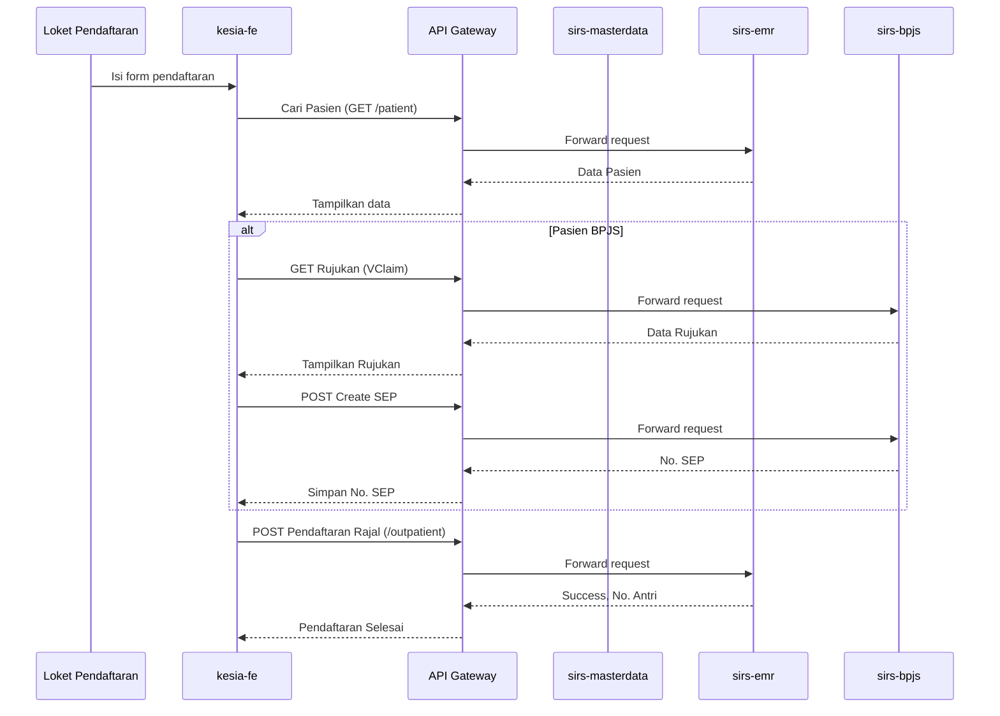

# Alur Kerja E2E SIRS Kesia - RAWAT JALAN

Dokumen ini merinci alur kerja end-to-end untuk modul Rawat Jalan di SIRS Kesia, mencakup pendaftaran, pelayanan, hingga penyelesaian administrasi untuk tiga jenis penjamin: Umum, Perusahaan, dan BPJS.

## A. Titik Masuk & Aktor Utama

-   **Pendaftaran (Admission):** `outpatient-registration` (Loket), `er-registration` (jika dari IGD), Kiosk, Mobile App.
-   **Perawat (Nurse):** `outpatient-nurse` (Asesmen awal, vital sign).
-   **Dokter (Doctor):** `outpatient-doctor` (SOAP, diagnosa, resep, tindakan).
-   **Farmasi (Pharmacy):** `outpatient-pharmacy` (Penyiapan & penyerahan obat).
-   **Kasir (Cashier):** `cashier` (Pembayaran).
-   **Staf Billing (Billing Staff):** `billing-staff` (Verifikasi & klaim).

## B. Alur Pendaftaran (Admisi)

Alur ini dimulai di page `kesia-fe/src/pages/outpatient-registration`.

### B.1. Pendaftaran Pasien Baru vs. Lama

1.  **Pencarian Pasien:** Petugas menggunakan `PatientAutocomplete` untuk mencari pasien berdasarkan No. RM, Nama, atau NIK.
    -   **Backend:** `sirs-emr-microservice` -> `PatientController.js` -> `GET /api/v1/emr/patient`
2.  **Pasien Baru:** Jika tidak ditemukan, petugas akan mendaftar sebagai pasien baru (`FormPrimaryPersonalData.js`).
    -   **Validasi NIK:** Dilakukan via `bridging-disdukcapil` jika terkonfigurasi.
    -   **Backend:** `sirs-emr-microservice` -> `PatientRegistrationController.js` -> `POST /api/v1/emr/patient-registration`
3.  **Pasien Lama:** Data pasien yang ada akan ditampilkan dan petugas melanjutkan ke pemilihan poliklinik dan dokter.

### B.2. Pemilihan Poliklinik & Penjamin

1.  **Pemilihan Jadwal:** Petugas memilih poliklinik (unit), dokter, dan jadwal yang tersedia.
    -   **Backend:** `sirs-masterdata-microservice` -> `DoctorScheduleController.js` -> `GET /api/v1/masterdata/doctor-schedule`
2.  **Pemilihan Penjamin (`insurerType`):** Ini adalah titik divergensi utama alur.
    -   **Umum (General):** Pasien membayar sendiri.
    -   **Perusahaan/Asuransi (Company/Insurance):** Memerlukan pemilihan perusahaan dari `company-partner`.
    -   **BPJS:** Memerlukan nomor rujukan (dari FKTP atau internal) atau nomor surat kontrol.

#### Alur Spesifik BPJS pada Pendaftaran:

-   **Validasi Rujukan/SEP:** Sistem akan melakukan bridging ke VClaim BPJS.
    -   **FE:** `kesia-fe/src/pages/bridging-bpjs`
    -   **BE:** `sirs-bpjs-microservice`
-   **Pembuatan SEP (Surat Eligibilitas Peserta):** Jika rujukan valid, SEP akan dibuat secara otomatis. Nomor SEP akan disimpan dan menjadi kunci untuk proses klaim selanjutnya.
    -   **BE:** `POST /api/v1/bpjs/sep`

### B.3. Konfirmasi & Cetak Struk

-   Setelah semua data terisi, pendaftaran dikonfirmasi.
-   **Backend:** `sirs-emr-microservice` -> `OutpatientController.js` -> `POST /api/v1/emr/outpatient`
-   Sistem menghasilkan nomor antrian poliklinik dan mencetak struk pendaftaran. Episode pasien (`emr_episode`) dibuat dengan status 'check-in'.

## C. Alur Pelayanan di Poliklinik

### C.1. Asesmen Awal oleh Perawat

-   **Aktor:** Perawat di `outpatient-nurse`.
-   Perawat memanggil pasien dari antrian (`PolyQueueTv`).
-   Melakukan asesmen awal, mengukur tanda-tanda vital (TTV).
-   **FE:** `kesia-fe/src/pages/outpatient-nurse/assessment`
-   **BE:** Data disimpan dalam `emr_episode` atau tabel terkait seperti `vital_sign`. `POST /api/v1/emr/vital-sign`.

### C.2. Pemeriksaan oleh Dokter

-   **Aktor:** Dokter di `outpatient-doctor`.
-   Dokter memanggil pasien dan melihat data asesmen awal dari perawat.
-   **Pemeriksaan & SOAP:** Dokter melakukan anamnesa, pemeriksaan fisik, dan mencatatnya dalam format SOAP (Subjective, Objective, Assessment, Planning).
    -   **FE:** `kesia-fe/src/pages/outpatient-doctor/integrated-note`
    -   **BE:** `sirs-emr-microservice` -> `IntegratedNoteController.js` -> `POST/PUT /api/v1/emr/integrated-note`
-   **Input Diagnosa (ICD-10):** Dokter memasukkan diagnosa primer dan sekunder.
    -   **BE:** `sirs-masterdata-microservice` untuk mencari ICD, disimpan bersama `integrated_note`.
-   **Input Tindakan (ICD-9/Lainnya):** Dokter dapat menambahkan tindakan medis yang dilakukan.
    -   **BE:** `sirs-emr-microservice` -> `MedicalServiceCostController.js`. Tindakan ini akan masuk ke rincian tagihan.
-   **Membuat Resep (Prescription):**
    -   **Tipe Resep:** Resep bisa berupa obat jadi atau racikan.
    -   **FE:** `kesia-fe/src/pages/outpatient-doctor/prescription`
    -   **BE:** `sirs-emr-microservice` -> `PrescriptionController.js` -> `POST /api/v1/emr/prescription`.
-   **Membuat Rujukan Penunjang Medis (Lab/Rad):**
    -   **FE:** `kesia-fe/src/pages/outpatient-doctor/medical-support`
    -   **BE:** `sirs-emr-microservice` -> `MedicalSupportController.js` -> `POST /api/v1/emr/medical-support`. Order akan muncul di unit lab/radiologi.
-   **Surat Kontrol (untuk Pasien BPJS):** Jika perlu kontrol ulang, dokter membuat surat kontrol.
    -   **FE:** `kesia-fe/src/pages/adminBpjs/control-plan-letter`
    -   **BE:** `sirs-bpjs-microservice` -> `POST /vclaim/suratkontrol`.

## D. Alur Farmasi

-   **Aktor:** Apoteker/Asisten Apoteker di `outpatient-pharmacy`.
-   Resep dari dokter secara otomatis masuk ke antrian farmasi.
-   Apoteker melakukan verifikasi resep, menyiapkan obat, dan menyerahkannya kepada pasien.
-   **Stock:** Sistem akan memotong stok obat dari gudang farmasi.
    -   **BE:** Interaksi dengan `sirs-erp-poster-microservice` atau modul inventory internal.
-   **Tagihan Obat:** Biaya obat secara otomatis masuk ke dalam tagihan pasien.

## E. Alur Penyelesaian Administrasi & Pembayaran

### E.1. Generasi Tagihan (Billing)

-   Tagihan (`invoice`) digenerate secara otomatis, mengakumulasi semua biaya:
    -   Registrasi & Konsultasi Dokter
    -   Tindakan Medis
    -   Obat-obatan dari Farmasi
    -   Pemeriksaan Penunjang (Lab/Rad)
-   **BE:** `sirs-emr-microservice` -> `InvoiceController.js`.

### E.2. Proses Pembayaran (Divergensi per Penjamin)

-   **Aktor:** Kasir di `cashier`.

#### Penjamin Umum:
1.  Kasir memanggil pasien.
2.  Pasien melakukan pembayaran secara tunai, debit, atau kredit.
3.  Kasir menutup tagihan. `emr_episode` status menjadi 'closed'.

#### Penjamin Perusahaan:
1.  Kasir memverifikasi detail penjamin dan benefit yang ditanggung.
2.  Jika ada selisih biaya (co-payment) yang tidak ditanggung, pasien membayarnya.
3.  Tagihan ditandai sebagai "Piutang Perusahaan".
4.  Staf `billing-staff` nantinya akan melakukan penagihan kolektif ke perusahaan terkait.

#### Penjamin BPJS:
1.  **Grouping & Klaim:** Staf `billing-staff` atau `casemix` akan memproses tagihan.
    -   **FE:** `kesia-fe/src/pages/casemix`
2.  Semua tindakan dan diagnosa di-grouping menggunakan INA-CBG's Grouper (terintegrasi via `sirs-bpjs-microservice`).
3.  Hasil grouping menghasilkan biaya klaim yang akan diajukan ke BPJS.
4.  Klaim dikirim secara elektronik. Pasien tidak melakukan pembayaran apa pun (kecuali ada tindakan/obat di luar tanggungan BPJS, yang seharusnya sudah diinformasikan di awal).
5.  Tagihan ditandai sebagai "Piutang BPJS".

## F. Diagram Alur Data (Sequence Diagram - High Level)

---
Analisis awal ini mencakup alur utama Rawat Jalan. Saya akan melanjutkan dengan analisis Rawat Inap.
